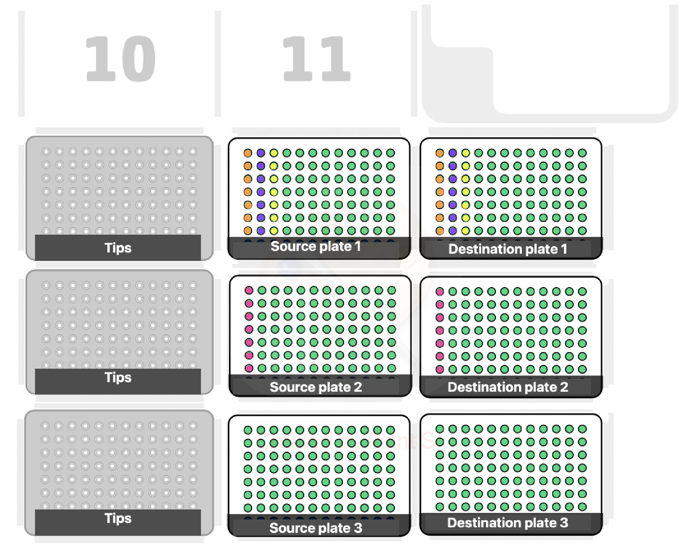

# Opentron OT-2 project

## Table of Contents
1. [Introduction](#introduction)
    - [Background](#background)
    - [Goals](#goals)
2. [Scrip](#scrip)
    - [96-well plate to 384-well plate](#96-well-plate-to-384-well-plate)
    - [96-well plate to 96-well plate](#96-well-plate-to-96-well-plate)

## Introduction

### Background

### Goals

## Scrip

### 96-well plate to 384-well plate
This script transfers liquid from one to four 96-well plates into a single 384-well plate. The number of columns for each 96-well plate can be adjusted in the script below.

### 96-well plate to 96-well plate

This script transfers liquid from one to three 96-well plates using an 8-channel head, performing minor transfers. The number of columns for each 96-well plate can be adjusted in the script.

An example of where the number of columns can be adjusted is shown below.

An image showing how the liquid is stamped and how the deck is configured is displayed below.

