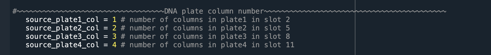
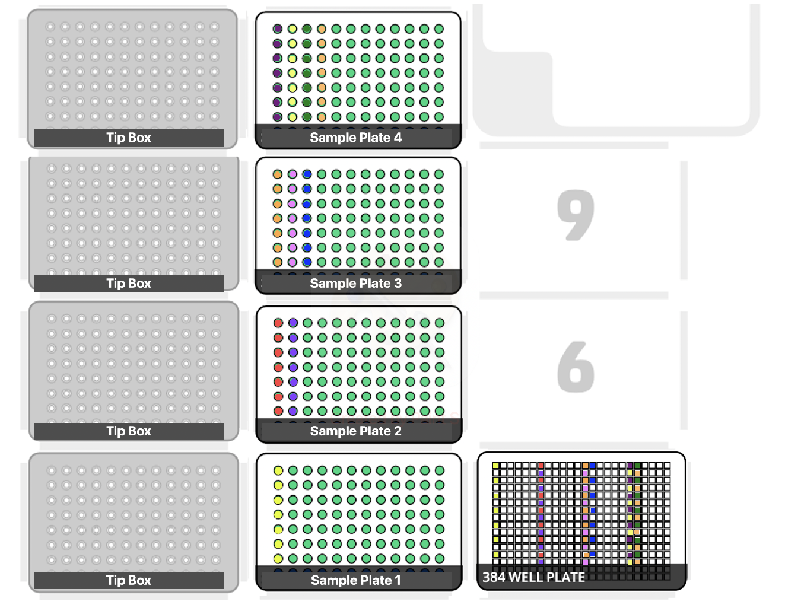

# Opentron OT-2 project

## Table of Contents
1. [Introduction](#introduction)
2. [Script](#script)
    - [96-well plate to 384-well plate](#96-well-plate-to-384-well-plate)
    - [96-well plate to 96-well plate](#96-well-plate-to-96-well-plate)

## Introduction
Opentrons is a biotechnology company that manufactures liquid handling robots, with each run controlled by a Python script. The goal of the script is to automate repetitive lab work by offering an easy way to edit the code, rather than relying on a predefined number of samples to transfer. It allows dynamic adjustments to the number of columns filled with reagents, enabling the transfer of varying amounts of liquid between different source and destination plates.

For the script to run correctly with the Opentrons app, make sure to verify that the tip box and tool head match the ones specified in the script. In this case, the left side of the tool head holds a P20 multi-channel pipette, while the right side holds a P300 multi-channel pipette. Calibration of the labware may also be necessary to ensure the pipettes reach the correct locations.

## Script

### 96-well plate to 384-well plate
This script uses opentrons_96_tiprack_20ul to transfers liquid from one to four 96-well plates into a single 384-well plate. The number of columns for each 96-well plate can be adjusted in the script below.

An example of where the number of columns can be adjusted is shown below.

An image showing how the liquid is stamped and how the deck is configured is displayed below.

### 96-well plate to 96-well plate
This script uses opentrons_96_tiprack_20ul to transfers liquid from one to three 96-well plates using an 8-channel head, performing minor transfers. The number of columns for each 96-well plate can be adjusted in the script.

An example of where the number of columns can be adjusted is shown below.

An image showing how the liquid is stamped and how the deck is configured is displayed below.

